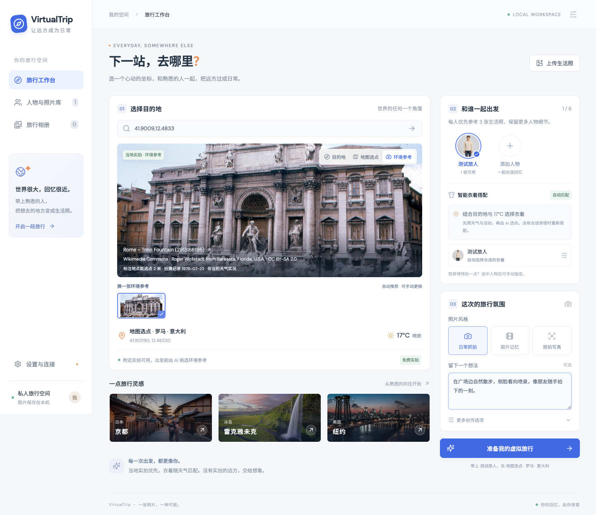
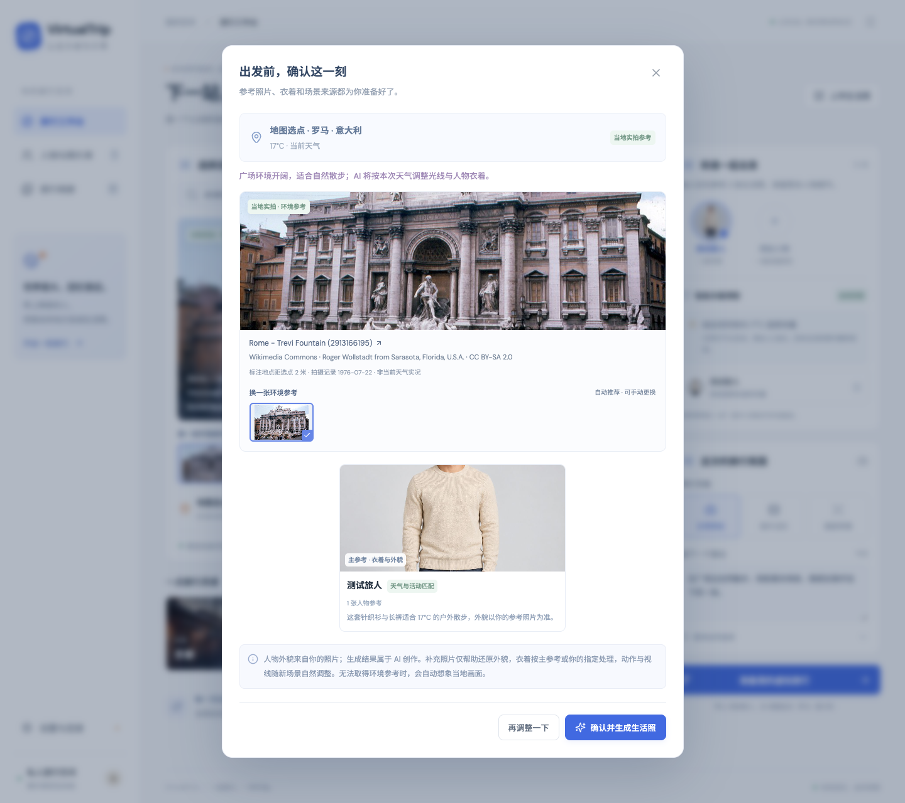
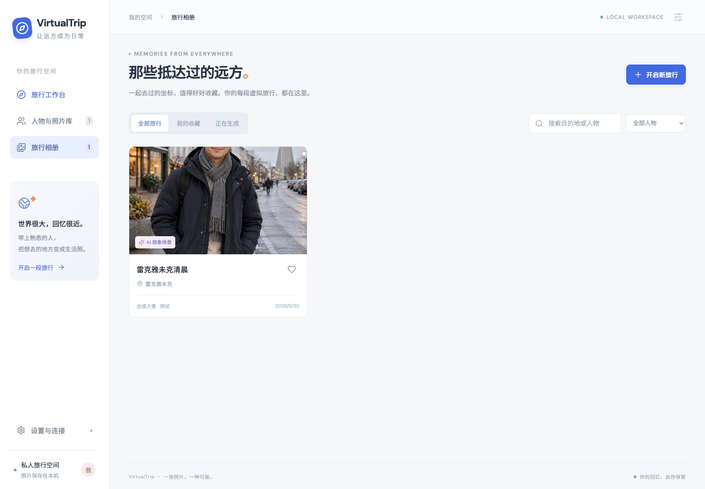
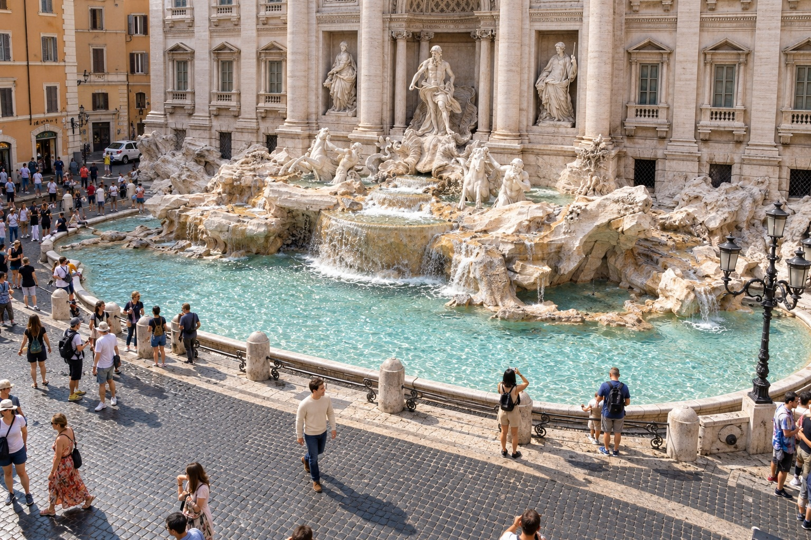

# VirtualTrip

一个运行在本机的私人虚拟旅行网页：把生活照按人物整理，让 AI 提取可见特征与穿搭信息，再根据地图位置和同行者生成新的旅行照片。

## 界面预览

以下截图使用虚构测试人像与测试数据，不含私人照片或真实凭据。工作台与确认弹窗展示当前界面，照片库和相册截图来自此前的端到端测试。

### 旅行工作台

选择地图坐标、查看当地实拍环境和天气，再选择同行者、衣着与拍摄要求。默认使用免费实拍，没有合适照片时自动想象当地。



### 照片库与出发前确认

生活照按人物保存并索引穿搭特征；生成前可以检查环境参考、人物照片和衣着处理。

| 人物与照片库                                                                  | 出发前确认                                                                                 |
| ----------------------------------------------------------------------------- | ------------------------------------------------------------------------------------------ |
|  |  |

### 旅行相册

生成结果会收入相册，可以收藏、按人物筛选、查看详情和下载。下图是此前以虚构人像测试寒冷天气换装的结果。



<details>
<summary>查看手机界面</summary>

手机端按目的地、同行者和拍摄要求依次排列，底部提供页面导航。


</details>

截图中的罗马环境参考来自 [Wikimedia Commons](<https://commons.wikimedia.org/wiki/File:Rome_-_Trevi_Fountain_(2913166195).jpg>)，作者 Roger Wollstadt，许可为 [CC BY-SA 2.0](https://creativecommons.org/licenses/by-sa/2.0/)。人物参考及相册中的人物为 AI 生成的测试素材。

## 运行

需要 **Node.js 24 或以上**（使用内置 SQLite）。

```sh
npm install
cp config/example.json config/local.json # 已有配置时不要覆盖
# 修改 config/local.json 中的 API Key
npm run dev
```

打开 http://127.0.0.1:3210 。应用仅监听本机。API 密钥填写在本机的 `config/local.json` 中，密钥文件不纳入版本控制。

生产运行：

```sh
npm run build
NODE_ENV=production npm start
```

默认文本 / 视觉模型 `gpt-6-luna`，图像模型 `gpt-image-2.5-flare`。服务端通过 OpenAI 兼容的 `/v1/chat/completions` 和 `/v1/images/edits` 接入，参考照片以 multipart 多图传递。也可以从设置页修改服务地址和模型，测试已保存的连接。

## 使用流程

1. **建立人物档案**：为自己、家人或朋友添加名字和备注。
2. **上传生活照**：每次最多 12 张，每张不超过 20MB，支持 JPEG、PNG 和 WebP。照片按人物保存；合照可注明主体位置。上传时纠正旋转、缩小超大图并去除 EXIF 元数据。
3. **自动分析与索引**：提取可见外貌、衣着、配饰、风格、颜色、适宜季节与温度范围。SQLite 保存结构化结果和 trigram 全文索引，支持中文短词检索与组合搜索。无法识别可用人物的照片不能用于旅行生成。照片详情支持重新分析和删除。
4. **选择目的地**：搜索地点、输入 `纬度, 经度` 或点击地图任意位置。地图使用 OpenStreetMap；地图选点会尽量解析附近城镇与国家，供 AI 生成环境时参考。地点搜索优先使用 Google Geocoding，未配置时使用 Nominatim（按提交搜索，不做自动补全）。天气来自 Open-Meteo 的当前观测 / 模型数据，失败时明确显示未知。
5. **选择同行者**：最多 6 人。每人须至少有一张成功分析且存在人物的照片。系统先按温度与活动排除不合适的衣着（例如城市散步时的救生衣），再由文本模型比较候选穿搭，结合目的地、拍摄要求和最近使用的衣着选择主参考。脸部清晰度主要用于补充外貌参考，优先每人 3 张（不足时使用现有照片）。补充图只参考外貌，不复制其衣着；没有匹配时，仅使用照片中的人物身份特征，并让 AI 调整成适合温度的穿搭；极寒目的地使用极地保暖装备。AI 选衣暂时不可用时明确标注并降级到天气与活动规则；只有一套可用穿搭时直接使用它。未知天气使用保守的分层穿搭。
6. **指定风格与衣着**：可选日常抓拍、胶片记忆、旅拍写真或无人机航拍，配置横图、竖图、方图和光线。每种风格都有明确的摄影指令，参与环境选图、场景规划和最终生图。可以为每人手动选择某张照片的衣着，或输入穿搭要求；手动衣着优先于天气规则。更多选项中的温度输入可用于模拟其他季节，避免把当前天气当成未来预报。
7. **预览与生成**：先检查每个人的参考照片、衣着处理及场景来源，再启动生成。免费实拍模式会由视觉模型从附近照片中选择环境参考，也可以点击候选缩略图手动更换。预览中的选择会保留 10 分钟，确认时沿用该方案，不重新选衣或选环境；更换环境图会刷新确认方案，其他选项或人物参考变化时要求重新预览。动作、手势、视线与多人互动根据新场景和你的要求重新设计，不照搬参考照片的姿势。生成任务持久化保存状态，串行运行，可切换页面继续浏览；失败或重启中断后可重试。完成后在旅行相册查看、收藏、按人物筛选和下载。

## 摄影风格

| 风格       | 具体摄影要求                                                                                                                             |
| ---------- | ---------------------------------------------------------------------------------------------------------------------------------------- |
| 日常抓拍   | 平视手持视角、约 28–40mm 等效焦段、自然动作、真实色彩与环境光，避免影棚摆拍和过度磨皮。                                                  |
| 胶片记忆   | 35mm 胶片质感、细腻颗粒、略低饱和度、柔和反差与高光过渡，保留人物细节和衣着颜色，不强制变成日落或泛黄滤镜。                              |
| 旅拍写真   | 约 50–85mm 等效人像视角、讲究构图和人物层次、符合天气与时间的柔和定向光，动作更有表现力，保持原本外貌与选定衣着。                        |
| 无人机航拍 | 模拟约 8–20 米高、向下 35–65° 的斜俯拍，约 24–28mm 等效广角；人物通常占画面高度 10–25%，突出道路、广场、海岸与地形，统一地面透视和阴影。 |

风格定义集中保存在 `shared/photography.json`，场景规划和最终图像请求都会包含完整指令，而不只是风格名称。清晨、日落、夜晚等光线偏好会单独传入；明确的镜头、动作和光线要求可以覆盖预设默认值，人物身份、人数、衣着约束仍保留。

航拍时优先选取开阔的高视角实拍；只有地面参考图时，AI 会根据可见建筑与地形重构合理的俯拍场景。人物在远景中的面部细节会减少，重构的屋顶和布局属于 AI 推断。

下图是本地模型网关的航拍生成测试：使用虚构测试人像和上述罗马环境参考，人物穿着米色针织衫，在广场边散步。俯拍角度与画面布局由 AI 重构，属于生成示例。



## 自动场景来源

**默认不启用 Google 街景，即使已保存 Google Key。** 环境来源默认是 Wikimedia Commons，无需申请图库密钥。实拍与想象自动衔接，不用手动选择“想象模式”。

- 先搜索所选坐标附近 3 公里的带地理标记照片，没有可用照片时扩大到 10 公里。筛除明显地图、肖像、演出等内容后展示最多 6 张候选。照片位置、年代和天气可能与选点不同，界面显示标注地点的距离和拍摄记录。
- 出发前，视觉模型读取最多 4 张候选，结合目的地、天气和要求选择适合容纳人物的环境；模型认为全部不合适时自动想象当地。AI 选图暂时失败时先采用可加载的候选并标注，可以手动更换。手动选图始终优先。
- 选定的实拍是生图的第一张环境参考图；后续按人物分组传入多张外貌参考，并明确每组对应同一个人。每次最多 16 张输入，环境图占用 1 张；多人时先保证每人有主参考和补充参考，再分配第三张。环境图中原有的人物不作为同行者参考，画面光线和天气按请求调整。
- 无覆盖、图库不可用、图片加载失败或没有合适照片时：自动降级为 AI 想象当地，人物参考图片仍完整传递。不会自动调用 Google 兜底。
- 作者、照片出处和许可证自动保存到生成相册，没有额外授权确认步骤。Commons 查询、缩略图和 AI 选图结果在内存中缓存 30 分钟，减少重复请求；原始环境图片不写入人物照片库。
- 环境图使用图库支持的标准缩略图，兼容 Wikimedia 的新旧图片域名；最多同时下载 3 张，同一张图共享请求。遇到限流会遵守图库的等待时间，其他加载失败会短暂缓存；界面显示手动重试入口，避免连续自动请求。
- 相册记录最终实际使用的来源，区分当地实拍参考、真实街景参考与 AI 想象场景。
- 目的地首页的 Unsplash 图片只用于旅行灵感，明确标注为非所选坐标实景，不参与生成。

若要使用 Google 街景，须在设置页将“环境照片来源”切换为 **Google 街景**，填入 Google Maps API Key，并在 Google Cloud 中启用 **Street View Static API**。旋转预览镜头只在松开滑块或完成键盘调整后取图，避免拖动过程连续请求。缺失街景时仍自动想象当地。启用 **Geocoding API** 可增强地点搜索。Google 原始街景仅暂存在运行内存，代理响应设置 `no-store`；不放入照片库，持久化仅保留 panorama ID 和生成的创作描述。街景预览保留归属信息。

## 保存与配置

- `config/local.json`：API 地址、服务密钥、Google 密钥、环境提供方（`environment.provider`，默认 `commons`，可选 `google`）、模型和端口；权限为 `0600`，被 `.gitignore` 忽略。
- `data/virtualtrip.sqlite`：人物、照片分析、全文索引、生成任务与相册记录。
- `data/photo-*.jpg` / `data/trip-*.jpg`：原始参考照片和生成结果。
- 密钥不从服务端返回到网页。网页不直接调用模型；上传和生成所需的图片会由服务端发送到配置的模型网关。
- 备份时先停止服务，再备份 `data/` 与配置。删除人物会删除其原始照片与索引，保留已生成的旅行相册。
- 目前是单人本机应用，没有远程账户系统。更换端口后重启服务。

## 验证

```sh
npm run check
npm test
npm run build
# 可选浏览器交互测试（先启动网页）
npx playwright install chromium
npm run test:browser
```

测试覆盖四种风格的完整摄影指令传递、航拍视角与选图、夜间光线约束、切换风格后的重新预览，以及 Commons 默认策略（已有 Google Key 也不调用街景）、地理搜索与缓存、照片元数据、视觉选图与降级、手动环境选择、作者来源保存、环境与人物多图顺序、场景选衣、专用装备筛选、AI 选择约束与降级、预览与生成一致性、场景动作指令、寒冷目的地排除夏装、无匹配衣着时换装、手动优先、天气未知、多人身份映射、补充图的衣着隔离、输入数量预算与画幅对齐、生成失败、参数校验与全文索引。浏览器检查包含四种风格选择、航拍预览与生成请求、候选图切换、预览确认沿用选图、默认环境设置与桌面 / 手机布局。外部服务在自动化测试中使用受控响应，不依赖 Google 计费密钥。

当前已通过本地网关的真实文本 / 视觉分析和真实图片编辑请求，Commons 实拍检索、视觉选图及环境加人物多图生图，以及桌面和手机浏览器交互检查。实拍链路使用虚构人像测试，未向你的相册添加测试旅行。Google 街景需主动开启后单独验证；合成人像测试不代表你的照片已经完成人物相似度验收。AI 生成的人物和环境可能需要多次调整。

API 参考：[Commons 按位置搜索](https://commons.wikimedia.org/wiki/Commons:Search_by_location)、[Commons 内容使用](https://commons.wikimedia.org/wiki/Commons:Reusing_content_outside_Wikimedia)、[OpenAI 图像生成](https://developers.openai.com/api/docs/guides/image-generation)、[Google 街景元数据](https://developers.google.com/maps/documentation/streetview/metadata)、[Open-Meteo](https://open-meteo.com/en/docs)。
